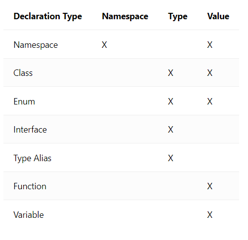

# Tìm hiểu về Typescript :rocket:


## Mục Lục :mag:

  

1.Typescript và lịch sử

  

2.Interface:

  

- interface là gì? khác gì với Type

- các built-in Type primitives

- các common built-in JS Object

- Generics

- Overloads

- Get $ Set

- Extension via merging

- Class Comformance

  

3.Type

- Primitives type

- Object literal type

- Tuple type

- Union type

- Intersecsion type

- Type indexing

- Mapped type

- Conditional type

4.Class

- Generics class

- các từ khóa `protected`  `static`  `public`  `private`

## Nội dung

### 1.Typescript(TS) là gì ? và lịch sử của TS

#### 1.1 Typescript là gì ?

TypeScript là một ngôn ngữ lập trình được phát triển và duy trì bởi Microsoft. Nó là một tập hợp siêu cú pháp nghiêm ngặt của JavaScript và thêm tính năng nhập tĩnh tùy chọn vào ngôn ngữ. Nó được thiết kế để phát triển các ứng dụng lớn và chuyển đổi sang JavaScript. Vì nó là một tập hợp siêu JavaScript nên các chương trình JavaScript hiện có cũng là các chương trình TypeScript hợp lệ.

#### 1.2 Lịch sử của TS

- TypeScript được công bố lần đầu tiên vào tháng 10 năm 2012 (ở phiên bản 0.8)

- TypeScript 0.9, được phát hành vào năm 2013, đã thêm hỗ trợ cho generic.

- TypeScript 1.0 được phát hành tại hội nghị nhà phát triển Build (hội nghị nhà phát triển)") của Microsoft vào năm 2014.

- Vào tháng 7 năm 2014, nhóm phát triển đã công bố một trình biên dịch TypeScript mới, đạt hiệu suất gấp 5 lần

- Vào ngày 22 tháng 9 năm 2016, TypeScript 2.0 đã được phát hành; nó đã giới thiệu một số tính năng, bao gồm khả năng cho các lập trình viên tùy ý ngăn các biến được gán giá trị `null`

- TypeScript 3.0 được phát hành vào ngày 30 tháng 7 năm 2018,mang đến nhiều bổ sung ngôn ngữ như bộ giá trị trong tham số phần còn lại và biểu thức trải rộng, tham số phần còn lại với các loại tuple, tham số rest chung, v.v.

- TypeScript 4.0 được phát hành vào ngày 20 tháng 8 năm 2020.Mặc dù 4.0 không giới thiệu bất kỳ thay đổi đột phá nào, nhưng nó đã bổ sung các tính năng ngôn ngữ như Hệ thống JSX tùy chỉnh và kiểu Tuple Đa dạng

### 2.Interface trong TS

#### 2.1 Interface là gì ?

Interface là cách để định nghĩa một cấu trúc mà bất cứ Class nào khi sử dụng nó đều phải tuân thủ các biến và phương thức có trong interface

Ví dụ :

Ta có một interface IPerson

```ts

interface  IPerson {

firstName:string,

lastName:string,

sayHi: ()=>string

}

```

Lớp customer sử interface IPerson vì vậy sẽ phải tuân thủ theo đúng nguyên tắc có trong interface IPerson

```ts

var  customer:IPerson = {

firstName:"Tom",

lastName:"Hanks",

sayHi: ():string  =>{return  "Hi there"}

}

  

console.log("Customer Object ")

console.log(customer.firstName)

console.log(customer.lastName)

console.log(customer.sayHi())

  

var  employee:IPerson = {

firstName:"Jim",

lastName:"Blakes",

sayHi: ():string  =>{return  "Hello!!!"}

}

console.log("Employee Object ")

console.log(employee.firstName);

console.log(employee.lastName);

```

#### 2.2 Các cách sử dụng Interface trong TS thông dụng

##### 2.2.1 **Interface định nghĩa cấu trúc cho function**

```ts

interface  KeyValueProcessor

{

(key:  number, value:  string):  void;

};

  

function  addKeyValue(key:number, value:string):void {

console.log('addKeyValue: key = '  +  key  +  ', value = '  +  value)

}

  

function  updateKeyValue(key:  number, value:string):void {

console.log('updateKeyValue: key = '+  key  +  ', value = '  +  value)

}

let  kvp:  KeyValueProcessor = addKeyValue;

kvp(1, 'Bill'); //Output: addKeyValue: key = 1, value = Bill

  

kvp = updateKeyValue;

kvp(2, 'Steve'); //Output: updateKeyValue: key = 2, value = Steve

```

Có thể thấy interface `KeyValueProcessor` đặt ra một số quy tắc cho fucntion nào sử dụng nó như :

- phải truyền 2 param

- param thứ nhất phải có kiểu dữ liệu là number

- param 2 phải có kiểu string

- kiểu trả về của function là void

##### 2.2.2 Interface định nghĩa cấu trúc cho Array

```ts

interface  IStringList {

[index:string]:string

}

  

let  strArr  :  IStringList;

strArr["TS"] = "TypeScript";

strArr["JS"] = "JavaScript";

```

bất kì list nào sử dụng interface IStringList đều phải tuân thủ đúng quy tắc:

- key là string

- value là string

##### 2.2.3 **Tham số tuỳ chọn**

```ts

interface  IEmployee {

empCode:  number;

empName:  string;

empDept?:string;

}

  

let  empObj1:IEmployee = { // true

empCode:1,

empName:"Steve"

}

  

let  empObj2:IEmployee = { // true

empCode:1,

empName:"Bill",

empDept:"IT"

}

let  empObj3:IEmployee = { // false

empCode:'2',

empName:"Steve"

}

```

Vẫn theo đúng quy tắc cũ nhưng ta có thể dùng dấu `?` trong property empDept biểu thị rằng nó có thể null .

#### 2.2.4 **Tham số chỉ được phép đọc - ReadOnly**

```ts

interface  Citizen {

name:  string;

readonly  SSN:  number;

}

  

let  personObj:  Citizen = { SSN:  110555444, name:  'James Bond' }

  

personObj.name = 'Steve Smith'; // OK

personObj.SSN = '333666888'; // Compiler Error

```

Trong Interface sẽ có những thuộc tính mà ta chỉ cho phép class dùng nó được đọc mà không được thay đổi giá trị.

#### 2.2.5 **Kế thừa Interface**

```ts

interface  IPerson {

name:  string;

gender:  string;

}

  

interface  IEmployee  extends  IPerson {

empCode:  number;

}

  

let  empObj:IEmployee = {

empCode:1,

name:"Bill",

gender:"Male"

}

```

Chúng ta có thể kế thừa một hoặc nhiều interface để sử dụng lại như ví dụ bên trên

#### 2.2.6 **Implement Interface**

TypeScript Interface cũng cho phép một class cài đặt nó. Chúng ta sử dụng từ khoá implements.

```ts

interface  IEmployee {

empCode:  number;

name:  string;

getSalary:(number)=>number;

}

  

class  Employee  implements  IEmployee {

empCode:  number;

name:  string;

  

constructor(code:  number, name:  string) {

this.empCode = code;

this.name = name;

}

  

getSalary(empCode:number):number {

return  20000;

}

}

  

let  emp = new  Employee(1, "Steve");

```

Khi đã implememt một interface nghĩa là bạn phải triển khai hết không được bỏ qua bất cứ cái gì .

#### 2.3 built-in Type primitives

| Tên | Mô tả |Ví dụ |

|--|--|-------|-----|

| string | đại diện cho kiểu dữ liệu văn bản |let name:string='Nguyễn Văn A'|

|number|đại diện cho kiểu số|let number1:number=1 // số nguyên <br  /> let number2:number=0b100 // số nhị phân etc...|

|boolean|giá trị trả về `true` hoặc `false`|let isContainInString:boolean=true|

|null|trả về giá trị `null`|let objectA = null|

|undifined|trả về một đối tượng,thuộc tính chưa được gán giá trị|const objectA = {hairColor:'black'} <br  /> objectA.skinColor => undefined|

|symbol|đại diện cho giá trị hằng số|let sym2 = Symbol("key");|

### 2.4 các common built-in JS Object

#### 2.4.1 kiểu dữ liệu any

##### 2.4.1.1 any là ?

any: Đây là kiểu dữ liệu tích hợp sẵn trong TypeScript giúp mô tả kiểu biến mà chúng tôi không chắc chắn trong khi viết mã

```ts

var  x:  any;

// sau đó x có thể gán với bất kì kiểu dữ liệu gì mà bạn muốn , number , string , boolean

```

tính năng :

- Kiểu dữ liệu này có thể được sử dụng khi không có định nghĩa về kiểu.

- Kiểu dữ liệu 'bất kỳ' có thể được sử dụng để biểu thị bất kỳ giá trị JavaScript nào

#### 2.4.2 unknown Type

Giống như `any` type, `unknown` type có thể assign bất kỳ value nào.

```ts

let  unknownValue:  unknown;

  

unknownValue = Math.random;

unknownValue = 1;

unknownValue = {};

unknownValue = [];

unknownValue = true;

unknownValue = "string";

unknownValue = null;

unknownValue = undefined;

unknownValue = Symbol("type");

```

Nếu như `any` type cho phép thực hiện bất kỳ operation nào mà không check type

thì `uknown` type lại gần như không cho phép thực hiện operation nào.

```ts

let  unknownValue:  unknown;

  

unknownValue.foo().bar(); // Error

unknownValue.toString(); // Error

unknownValue[0]; // Error

```

Chúng ta có thể sử dụng type-checking (narrow type) để có thể thực hiện các operation trên `unknown` type

```js

let  unknownValue:  unknow;

  

if (typeof  value  ===  "number") {

unknownValue  +  1

}

  

if (value  instanceOf  Xyz) {

new  Xyz()

}

  

```

### 2.5 Generics Interface

#### 2.5.1 Gererics là gì ?

Generics về cơ bản là một loại công cụ cho phép bạn tạo các thành phần mã có thể sử dụng lại hoạt động với nhiều type khác nhau thay vì chỉ một type duy nhất.

#### 2.5.2 Tại sao phải phải sử dụng generics ?

```ts

interface  cat {

  

model:  string;

  

}

  

class  Cat {

  

kindsOfCat:  cat[] = [];

  

AddSpeciesCat = (item:  cat) => {

  

this.kindsOfCat.push(item);

  

};

  

ShowListCat() {

  

this.kindsOfCat.forEach((element) => {

  

console.log(`loài ${element}`);

  

});

  

}

  

}

  

  

let  Cats = new  Cat();

  

let  species:  cat = {

  

model:  "Mớp",

  

};

  

Cats.AddSpeciesCat(species);

  

species = {

  

model:  "Anh",

  

};

  

Cats.AddSpeciesCat(species);

  

Cats.ShowListCat();

```

Mọi thứ có vẻ sẽ tuân đúng theo trình tự nếu chỉ dừng ở đây . Nhưng nếu ta cần xây dựng các lớp khác tương tự như class Cat . Mọi thứ bên trong vẫn bên y nguyên nhưng chỉ khác đối tượng . Một điều rất **quan trọng** khi code để tránh việc dòng code thành **rác** đó là việc lặp đi lặp lại các khối code .

  

Theo vì phải tạo ra các class cho Chó , Mèo , Lợn , Gà ta có thể sử dụng kiểu Gererics để tạo ra một lớp chung cho tất cả động vật

```ts

// interface cat {

  

// model: string;

  

// }

  

// class Cat {

  

// kindsOfCat: cat[] = [];

  

// AddSpeciesCat = (item: cat) => {

  

// this.kindsOfCat.push(item);

  

// };

  

// ShowListCat() {

  

// this.kindsOfCat.forEach((element) => {

  

// console.log(`loài ${element}`);

  

// });

  

// }

  

// }

  

  

// let Cats = new Cat();

  

// let species: cat = {

  

// model: "Mớp",

  

// };

  

// Cats.AddSpeciesCat(species);

  

// species = {

  

// model: "Anh",

  

// };

  

// Cats.AddSpeciesCat(species);

  

// Cats.ShowListCat();

  

  

interface  MeoowType {

  

model:  string;

  

name:  string;

  

}

  

interface  DogTypes {

  

model:  string;

  

name:  string;

  

}

  

class  Animal<T> {

  

kindsOfAnimal:  T[] = [];

  

AddSpeciesAnimal = (item:  T) => {

  

this.kindsOfAnimal.push(item);

  

};

  

ShowListAnimal() {

  

this.kindsOfAnimal.forEach((element) => {

  

console.log(`loài ${element}`);

  

});

  

}

  

}

  

  

let  MeoowlList = new  Animal<MeoowType>();

  

let  species:  MeoowType = {

  

model:  "Mớp",

  

name:  "mèo",

  

};

  

MeoowlList.AddSpeciesAnimal(species);

  

let  DogList = new  Animal<DogTypes>();

  

let  dogs:  DogTypes = {

  

model:  "Cảnh khuyển",

  

name:  "Chó",

  

};

  

DogList.AddSpeciesAnimal(dogs);

  

DogList.ShowListAnimal();

  

MeoowlList.ShowListAnimal();

  

```

#### 2.5.3 Generics và Interface

Interface đã được nói rất kĩ ở bài biết trước . Bài viết này sẽ nói về ứng dụng của gerenic vào interface.

##### 2.5.3.1 Dưới đây là một ví dụ rất cơ bản về Generics

* ứng dụng Generic và Interface thông thường .

```ts

interface  IProcessor<T>

{

result:T;

process(a:  T, b:  T) =>  T;

}

```

* ứng dụng Gereneric với Interface với kiểu dữ liệu

```ts

interface  KeyPair<T, U> {

key:  T;

value:  U;

}

  

let  kv1:  KeyPair<number, string> = { key:1, value:"Steve" }; // OK

let  kv2:  KeyPair<number, number> = { key:1, value:12345 }; // OK

```

Như bạn có thể thấy trong ví dụ trên, bằng cách sử dụng generics làm kiểu dữ liệu, chúng ta có thể chỉ định kiểu dữ liệu của khóa và giá trị

* Generic Interface với Function Type

```ts

interface  KeyValueProcessor<T, U>

{

(key:  T, val:  U):  void;

};

  

function  processNumKeyPairs(key:number, value:number):void {

console.log('processNumKeyPairs: key = '  +  key  +  ', value = '  +  value)

}

  

function  processStringKeyPairs(key:  number, value:string):void {

console.log('processStringKeyPairs: key = '+  key  +  ', value = '  +  value)

}

let  numKVProcessor:  KeyValueProcessor<number, number> = processNumKeyPairs;

numKVProcessor(1, 12345); //Output: processNumKeyPairs: key = 1, value = 12345

  

let  strKVProcessor:  KeyValueProcessor<number, string> = processStringKeyPairs;

strKVProcessor(1, "Bill"); //Output: processStringKeyPairs: key = 1, value = Bill

```

Ở bài viết interface ta có thể thấy , nếu khi sử dụng interface để định dạng một function thì kiểu dữ liệu của param1 và param2 đang bị hardcode kiểu dữ liệu . Việc sử dụng generic làm cho việc sử dụng param giờ đây rất linh động

  

Tuy nhiên các triên vẫn chưa thật sự tối ưu .Có một vấn đề là type param của `KeyValueProcessor` phải trùng với param `processNumKeyPairs` , vẫn có cái gì đó rất của hardcode . Chúng ta có thể viết lại kết hợp interface Gereric và function gerenic khiến các function của chúng ta chặt chẽ và `ảo diệu` hơn rất nhiều .

```ts

interface  KeyValueProcessor<T, U>

{

(key:  T, val:  U):  void;

};

  

function  processKeyPairs<T, U>(key:T, value:U):void {

console.log(`processKeyPairs: key = ${key}, value = ${value}`)

}

  

let  numKVProcessor:  KeyValueProcessor<number, number> = processKeyPairs;

numKVProcessor(1, 12345); //Output: processKeyPairs: key = 1, value = 12345

  

let  strKVProcessor:  KeyValueProcessor<number, string> = processKeyPairs;

strKVProcessor(1, "Bill"); //Output: processKeyPairs: key = 1, value = Bill

```

* Imlement gereric interface

```ts

interface  IKeyValueProcessor<T, U>

{

process(key:  T, val:  U):  void;

};

  

class  kvProcessor  implements  IKeyValueProcessor<number, string>

{

process(key:number, val:string):void {

console.log(`Key = ${key}, val = ${val}`);

}

}

  

let  proc:  IKeyValueProcessor<number, string> = new  kvProcessor();

proc.process(1, 'Bill'); //Output: processKeyPairs: key = 1, value = Bill

```

#### 2.6 Overloading

##### 2.6.1 Overloading là gì ?

TypeScript cung cấp khái niệm nạp chồng hàm( Overloading).Bạn có thể có nhiều hàm có cùng tên nhưng kiểu tham số và kiểu trả về khác nhau. Tuy nhiên, số lượng các tham số phải giống nhau

##### 2.6.2 Sử dụng Overloading như thế nào

```ts

function  add(a:string, b:string):string;

  

function  add(a:number, b:number):  number;

  

function  add(a:  any, b:any):  any {

return  a  +  b;

}

  

add("Hello ", "Steve"); // returns "Hello Steve"

add(10, 20); // returns 30

```

- Quy tắc :

- cùng tên hàm

- cùng số lượng param

- khác kiểu tham số

- khác kiểu trả về

#### 2.7 Getter và Setter trong TS

Getter và Setter trong TS khác giống với trong JS

```ts

class  Person {

private  _age:  number;

private  _firstName:  string;

private  _lastName:  string;

  

public  get  age() {

return  this._age;

}

  

public  set  age(theAge:  number) {

if (theAge  <=  0  ||  theAge  >=  200) {

throw  new  Error('The age is invalid');

}

this._age = theAge;

}

  

public  getFullName():  string {

return  `${this._firstName}  ${this._lastName}`;

}

}`

```

việc sử dụng `gettter` và `setter` sẽ giúp che dấu được tên của properties cũng như check được validate đầu vào

```ts

let  person = new  Person();

person.age = 10;

```

Step thực hiện :

- private properties

- public function getter hoặc setter

- vì là function nên bạn có thể check logics nếu muốn

#### 2.8 Extension via merging

##### 2.8.1 Declaration Merging là gì ?

Declaration Merging là khái niệm duy nhất trong TypeScript mô tả hình dạng của các đối tượng JavaScript ở các kiểu cấp độ

##### 2.8.2 Declaration Merging làm gì ?

Nó là một tính năng cho phép gộp các Namespace , Type và Value lại với nhau khi chúng trùng tên .

  



##### 2.8.3.1 Merging Interfaces

Kiểu khai báo hợp nhất đơn giản nhất và có lẽ là phổ biến nhất là hợp nhất interface. Ở cấp độ cơ bản nhất, hợp nhất kết hợp một cách máy móc các thành viên của cả hai khai báo thành một giao diện duy nhất có cùng tên

```ts

interface  Box {

  

height:  number;

  

width:  number;

  

}

  

interface  Box {

  

scale:  number;

  

}

  

let  box:  Box = { height:  5, width:  6, scale:  10 };

```

Đối với function member, mỗi member có cùng tên được coi là mô tả của cùng một chức năng. Một lưu ý nữa là trong trường hợp hợp nhất giao diện `A`với giao diện sau này `A`thì giao diện thứ hai sẽ được ưu tiên hơn so với giao diện đầu tiên.

  

ví dụ

```ts

interface  Cloner {

  

clone(animal:  Animal):  Animal;

  

}

  

interface  Cloner {

  

clone(animal:  Sheep):  Sheep;

  

}

  

interface  Cloner {

  

clone(animal:  Dog):  Dog;

  

clone(animal:  Cat):  Cat;

  

}

  

```

Kết quả sau khi merge xong sẽ kiểu như thế này

```ts

interface  Cloner {

  

clone(animal:  Dog):  Dog;

  

clone(animal:  Cat):  Cat;

  

clone(animal:  Sheep):  Sheep;

  

clone(animal:  Animal):  Animal;

  

}

```

Có một ngoại lệ nữa là quy tắc nếu pram truyền vào của function là chuỗi sẽ được ưu tiên trước . Ví dụ :

  

```ts

interface  Document {

  

createElement(tagName:  any):  Element;

  

}

  

interface  Document {

  

createElement(tagName:  "div"):  HTMLDivElement;

  

createElement(tagName:  "span"):  HTMLSpanElement;

  

}

  

interface  Document {

  

createElement(tagName:  string):  HTMLElement;

  

createElement(tagName:  "canvas"):  HTMLCanvasElement;

  

}

```

Sau khi merge sẽ được kết quả

```ts

interface  Document {

  

createElement(tagName:  "canvas"):  HTMLCanvasElement;

  

createElement(tagName:  "div"):  HTMLDivElement;

  

createElement(tagName:  "span"):  HTMLSpanElement;

  

createElement(tagName:  string):  HTMLElement;

  

createElement(tagName:  any):  Element;

  

}

```
#### 2.9 class comformance
2.9.1 **Class là gì ?**
Cũng giống như các ngôn ngữ lập trình Java, C#. Trong Typescript cũng hỗ trợ Class.
Một Class thì gồm các phần như constructor, thuộc tính và phương thức.
Ví dụ một class Employee trong Typescript
Ví dụ về một class trong TS 
```ts
class Employee {
    empCode: number;
    empName: string;

    constructor(code: number, name: string) {
            this.empName = name;
            this.empCode = code;
    }

    getSalary() : number {
        return 10000;
    }
}
```
compile nó sẽ dịch ra Javascript sẽ như thế này 
```js
var Employee = (function () {
    function Employee(name, code) {
        this.empName = name;
        this.empCode = code;
    }
    Employee.prototype.getSalary = function () {
        return 10000;
    };
        return Employee;
}());
```
2.9.2  **Constructor**
Constructor là một hàm đặc biệt nó được gọi khi chúng ta tạo đối tượng. Constructor được khai báo bằng từ khoá constructor.
```ts
class Employee {

    empCode: number;
    empName: string;
    // class có thể không cần contructor . có thể tùy chỉnh ở file tsconfig
    constructor(empcode: number, name: string ) {
        this.empCode = empcode;
        this.name = name;
    }
}
```
2.9.3 **Tạo một đối tượng từ Class ta sử dụng toán tử new.**
```ts 
class Employee {

    empCode: number;
    empName: string;
    
    constructor(empcode: number, name: string ) {
            this.empCode = empcode;
            this.name = name;
    }
}

let emp = new Employee(100,"Steve");
```